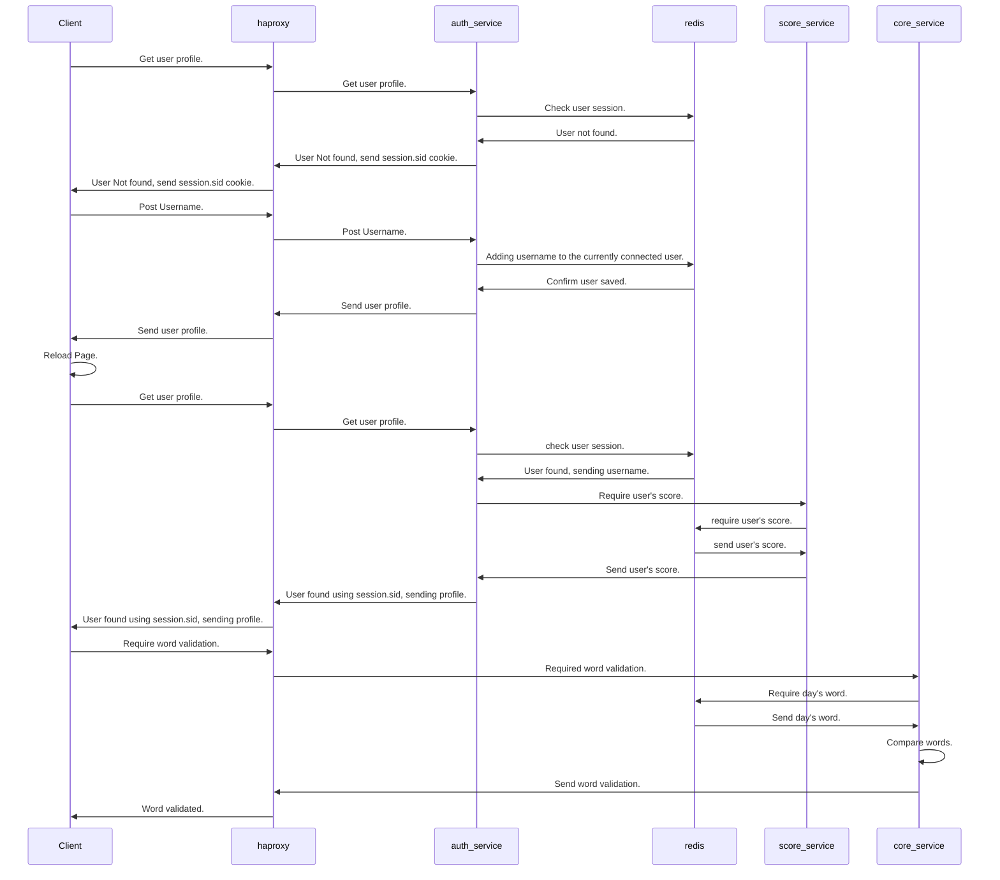

# project_motus
Repository du projet de Microservices Motus 

## Présentation 

Le jeu Motus est un jeu en ligne, dans lequel il faut découvrir le mot du jour, à partir de sa longueur, dans un nombre d'essai limité. 
Le mot masqué est mis à jour chaque jour, et vous disposez de cinq essais.  

## Fonctionnement du projet 

L'utilisateur se connecte sur le site Motus puis arrive sur la page lui permettant de deviner le mot du jour. 
La longueur du mot lui sont données. 
Les lettres bien placées s'affichent en vert. 
Les lettres contenues dans le mot mais mal placées s'affichent en jaune. 
Les lettres qui ne sont pas dans le mot s'affichent en rouge. 

Un score est attribué à chaque mot trouvé. 
Le score et le classement des joueurs sont consultables dans une autre page. 

## Comment utiliser le projet 

## Technologies utilisées 

## Diagramme de séquence 

