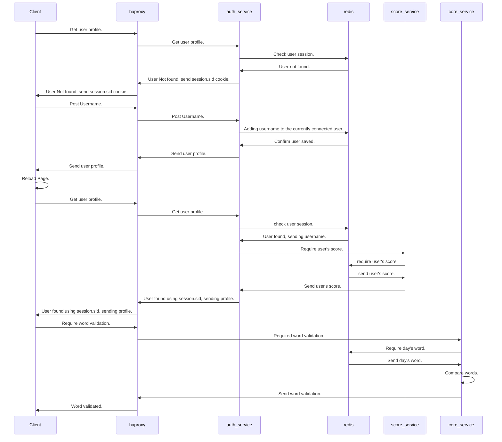

```mermaid
sequenceDiagram
    Client->>haproxy: Get user profile.
    haproxy->>auth_service: Get user profile.
    auth_service->>redis: Check user session.
    redis->>auth_service: User not found.
    auth_service->>haproxy: User Not found, send session.sid cookie.
    haproxy->>Client: User Not found, send session.sid cookie.
    Client->>haproxy: Post Username.
    haproxy->>auth_service: Post Username.
    auth_service->>redis: Adding username to the currently connected user.
    redis->>auth_service: Confirm user saved.
    auth_service->>haproxy:  Send user profile.
    haproxy->>Client: Send user profile.
    Client->>Client: Reload Page.
    Client->>haproxy: Get user profile.
    haproxy->>auth_service: Get user profile.
    auth_service->>redis: check user session.
    redis->>auth_service: User found, sending username.
    auth_service->>score_service: Require user's score.
    score_service->>redis: require user's score.
    redis->>score_service: send user's score.
    score_service->>auth_service: Send user's score.
    auth_service->>haproxy: User found using session.sid, sending profile.
    haproxy->>Client: User found using session.sid, sending profile.
    Client->>haproxy: Require word validation.
    haproxy->>core_service: Required word validation.
    core_service->>redis: Require day's word.
    redis->>core_service: Send day's word.
    core_service->>core_service: Compare words.
    core_service->>haproxy: Send word validation.
    haproxy->>Client: Word validated.
```
