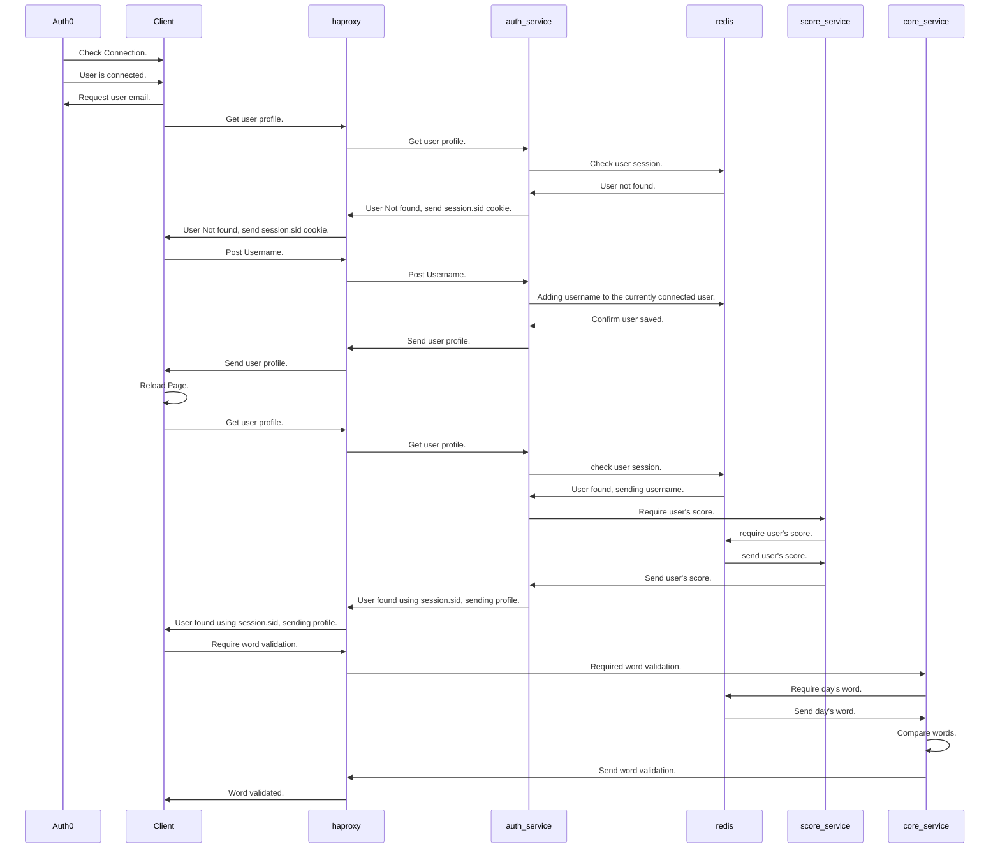

# project_motus
Repository du projet de Microservices Motus 

## Présentation 

Le jeu Motus est un jeu en ligne, dans lequel il faut découvrir le mot du jour, à partir de sa longueur, dans un nombre d'essai limité. 
Le mot masqué est mis à jour chaque jour, et vous disposez de cinq essais.  

## Lancement du projet

Ce projet utilise Docker pour conteneriser les services, pour lancer le projet, vous devez avoir docker installé sur votre machine.
1. Récupération du projet
```
git clone https://github.com/rossman-x/cy-ms.git
```
2. Construction du projet
```
cd cy-ms
docker-compose build
```

3. Lancement des services
```
docker-compose up -d
```

Le front-end du projet est lancé sur le port `8081`,  le back-end sur le port `3000`, grafana sur le port `3001`.

Il est possible d'appliquer des modifications directement sur le code, les contenaires seront relancés automatiquement grace a l'outil `nodemon` .

## Fonctionnement général 

L'utilisateur se connecte sur le site Motus puis arrive sur la page lui permettant de deviner le mot du jour. 
La longueur du mot lui sont données. 

Si l'utilisateur n'est pas connecté, il sera renvoyer sur une page Auth0 d'authentification en appuiant sur le button Login.

Les lettres bien placées s'affichent en vert, les lettres contenues dans le mot mais mal placées s'affichent en jaune et les lettres qui ne sont pas dans le mot s'affichent en rouge. 

Un score est attribué à chaque mot trouvé. 
Le score et le classement des joueurs sont consultables à la fin de chaque partie. 


## Technologies utilisées 

Voici une vue d’ensemble des technologies que nous avons utilisées dans le projet:

- Front: ReactJs
- Back: ExpressJs
- BDD et Cache: Redis
- Logs et monitoring : grafana- loki, grafana
- Reverse proxy, load balancing: haproxy
- Conteneurisation: Docker, docker-compose 

## Diagramme de séquence 



## Description des microservices et des API  

Le projet est composé de 3 API ainsi que d'une partie Front indépendante, totalisant 9 microservices. 

### API 

- authent-service: permet de se connecter ou de créer un compte. 
Crée une session Reddis et récupère les informations sur le joueur dans la BDD. 

- core-service: récupère le username, génère le mot du jour, compte le nombre d'essai du joueur, vérifie la saisie et l'emplacement des lettres, augmente le score si le mot est trouvé.  

- score-service: récupère le score avec le username, crée un score null si le joueur n'a jamais joué

### Front 

La partie front est codée en React. 
App.js permet de récuperer le profil de l'utilisateur et les données de jeu. 

Nous utilisons Tailwind pour faciliter la création de l'interface utilsateur.

### Authentification et Identification

L'utilisation d'un modèle d'authentification n'étais pas prévu au départ du projet, il suffisait de communiquer au back un username pour pouvoir se connecter, l'ajout de Auth0 s'est fait plus tard, elle va permettre à l'utilisateur de se connecter en utilisant un modèle de connection fourni par Auth0. À la récupération des données de connection de Auth0, le front envoie un username qui va correspondre à l'adresse mail utilisateur pour activer le fonctionnement du back, ce modèle d'authentification n'est pas idéal étant donné que l'utilisateur pourra se connecter en utilisant uniquement un username et sans passer par Auth0, le fait qu'on avait prévu d'utiliser un token de session nous a empecher de passer sur Auth0 coté back, donc aucune donnée Auth0 n'est communiquée au back à part l'email de l'utilisateur,

Pour améliorer la sécurité du projet, il est possible d'utiliser le token fournis par Auth0 pour identifier l'utilisateur, malheureusement Auth0 demande un paramètre `audience` pour permettre la génération d'un token, ce parametre corréspond à un end-point du back-end hosté publiquement sur le web ce qui sort du scope du projet.

### Redis

Redis permet le stockage `in-memory` des données, donc très rapide pour stocker du cache et la session utilisateur, nous l'utilisons pour enregistrer les données du score aussi.

### Haproxy

Haproxy est facile à utiliser, il a permet de faire le load balancing ainsi que le reverse proxy de ce projet, deux instance `auth_service` ont étés créés pour illustrer cet usage.

### Grafana
Grafana est un outils de monitoring et de gestion de logs, utilisé dans ce projet pour le suivis des appels `GET` et `POST` du back-end.
Les données de Grafana sont stockés dans grafana-loki.

### Microservices 

- auth_service_1  
- auth_service_2  
- score_service_1 
- core_service_1  
- front1         
- haproxy        
- cache           
- grafana-loki    
- grafana 
=======
Le projet est composé de 3 API et de 9 microservices. 

### Axes d'amélioration
- Utilisation correcte de Auth0, expliquée dans la partie Auth.
- Utilisation de Typescript pour éviter les bugs.
- Utilisation d'une library de test unitaier ex. `jest` pour tester le comportement des fonctions et faciliter le scaling.
- Hoster les conteneurs sur docker hub pour un déploiement plus rapide.
- Utilisation de Github CI/CD pour valider le code avant un merge/push.
- Utilisation d'un eslint pour éviter les fautes de syntax.

